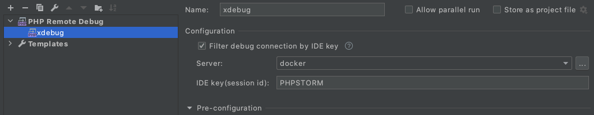
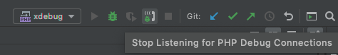

# Xdebugセットアップ方法

## PhpStormの設定

### Preference > Languages & Frameworks > PHP > Debug


```
・Debug port: 9001 に設定する。
```

### Preference > PHP > Servers


＊ この部分は設定しなくても、ブラウザの読み込みなどで通信が行われた場合にPHPSTORM側で自動的に設定が行われる。<br>
  ただし、ディレクトリのパスの設定はプロジェクトのルートディレクトリにする必要がある。

```
・"+"ボタンで設定を追加する。
・Name に任意の名前をつける。
・Host にローカルのアプリケーションのドメインを入力する。
・Port に "80" を入力する。
・Debugger は "Xdebug" を選択する。
・"User path mappings" にチェックをつける。
・プロジェクトのルートディレクトリに対して、docker-compose.ymlで設定されているリモートのアプリケーションのディレクトリのパスを入力する。
```

### Add Configuration (ウィンドウ右上)


```
・クリックして Run/Debug Configuration ウィンドウを開く。
```

### Run/Debug Configuration



```
・"+"ボタンで "PHP Remote Debug" を追加。
・Name に任意の名前をつける。
・"Filter debug connection by IDE key" にチェックをつける。
・Server に先ほど作成した設定を選択する。
・IDE key に "PHPSTORM" を入力。
```

### 実行



```
・"Start Listening for PHP Debug Connections" (右上の受話器のマーク) をONにする。
・ブレークポイントをセットし、phpを実行する。
```
